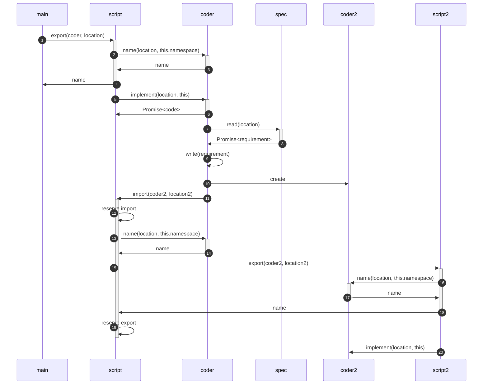

# TypeScript Generator

This is an overview how how the TypeScript Generator is going to work. As of this writing, most of the code does not exist yet.

The **Spec** encapsulates an openapi.yaml file and all of the files that it references (and all of the files that they reference...). Each object in the **Spec** is called a **Requirement** and exists at a particular URL (that can be referenced with `$ref`). A **Requirement** contains the parsed JSON object as well as the URL.

The **Repository** encapsulates all of the Typescript **Scripts** that will be generated. The **Repository** can retrieve a **Script** for a given path (and create it if it doesn't exist yet). A **Script** contains of a set of _imports_ and _exports_. (All of the code we generate will be part of either an `import` statement or an `export` statement.)

A **Coder** has a reference to the **Spec** and the **Repository**. Given a **Requirement** it returns TypeScript code. It can suggest a name for a **Script** to use for an import / export variable when given a **Location** and a namespace (the Set of names that are already taken).

We ask a **Script** to create an export by passing it a **Coder** and a URL. The **Coder** will tell the **Script** what to name the export. It will also give the **Script** a promise with the actual TypeScript code. (First it has to read the **Requirement** from the **Spec** at the URL.)

In the process of producing the code, a **Coder** may delegate work to another **Coder**, passing along a more specific **Requirement**. The delegate Coder may return the code (inline) or it may ask to write its code in a different **Script**. In that case, the delegate **Coder** will ask the current **Script** to _import_ code from another **Script**, passing along the delegate **Coder** and the URL from the **Requirement**. The importing **Script** will then ask the coder what it wants to name the variable (passing along its namespaces to avoid collisions) and return that name to the delegate **Coder**. The original **Coder** then outputs the variable name inline.

Meanwhile the **Script** asks the other Script for an _export_, passing along the delegate **Coder** and URL. The exporting **Script** asks the delegate **Coder** for an export variable name given the URL. It returns that name to the importing **Script** so it we can eventually write an `import { name } from "script.js";` (or `import {exportedName as localName} from "script.js";`) statement. The exporting **Script** reserves the export name and assigns it to the delegate **Coder**. It then asks the delegate **Coder** to read its **Requirement** at the **Location** in the **Spec** (asynchronously) and write the **Code** that will be exported.

